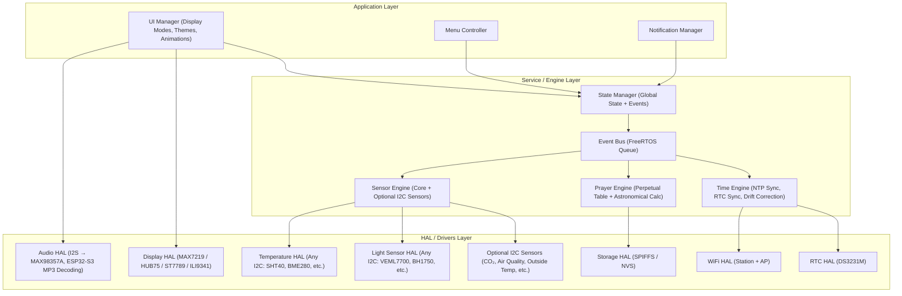

```mermaid
flowchart TB

subgraph APP["Application Layer"]
    UI_MANAGER["UI Manager (Display Modes, Themes, Animations)"]
    MENU_CONTROLLER["Menu Controller"]
    NOTIFY_MANAGER["Notification Manager"]
end

subgraph SERVICE["Service / Engine Layer"]
    STATE_MANAGER["State Manager (Global State + Events)"]
    EVENT_BUS["Event Bus (FreeRTOS Queue)"]
    SENSOR_ENGINE["Sensor Engine (Core + Optional I2C Sensors)"]
    PRAYER_ENGINE["Prayer Engine (Perpetual Table + Astronomical Calc)"]
    TIME_ENGINE["Time Engine (NTP Sync, RTC Sync, Drift Correction)"]
end

subgraph HAL["HAL / Drivers Layer"]
    AUDIO_HAL["Audio HAL (I2S → MAX98357A, ESP32‑S3 MP3 Decoding)"]
    DISPLAY_HAL["Display HAL (MAX7219 / HUB75 / ST7789 / ILI9341)"]
    TEMP_HAL["Temperature HAL (Any I2C: SHT40, BME280, etc.)"]
    LIGHT_HAL["Light Sensor HAL (Any I2C: VEML7700, BH1750, etc.)"]
    OPTIONAL_I2C["Optional I2C Sensors (CO₂, Air Quality, Outside Temp, etc.)"]
    STORAGE_HAL["Storage HAL (SPIFFS / NVS)"]
    WIFI_HAL["WiFi HAL (Station + AP)"]
    RTC_HAL["RTC HAL (DS3231M)"]
end

UI_MANAGER --> STATE_MANAGER
MENU_CONTROLLER --> STATE_MANAGER
NOTIFY_MANAGER --> STATE_MANAGER

STATE_MANAGER --> EVENT_BUS
EVENT_BUS --> TIME_ENGINE
EVENT_BUS --> PRAYER_ENGINE
EVENT_BUS --> SENSOR_ENGINE

TIME_ENGINE --> RTC_HAL
TIME_ENGINE --> WIFI_HAL

PRAYER_ENGINE --> STORAGE_HAL

SENSOR_ENGINE --> TEMP_HAL
SENSOR_ENGINE --> LIGHT_HAL
SENSOR_ENGINE --> OPTIONAL_I2C

UI_MANAGER --> DISPLAY_HAL
UI_MANAGER --> AUDIO_HAL
```
