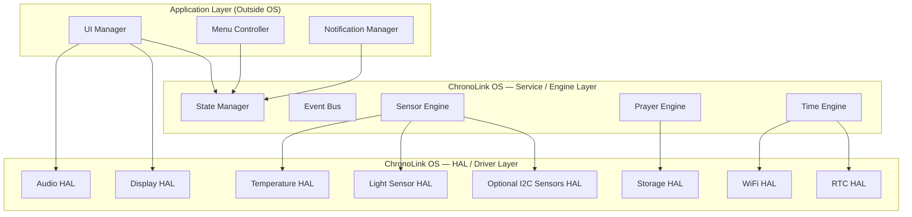

```mermaid
flowchart TB

%% ============================
%% APPLICATION LAYER (OUTSIDE OS)
%% ============================
subgraph APP["Application Layer (Outside OS)"]
    UI_MANAGER["UI Manager"]
    MENU_CONTROLLER["Menu Controller"]
    NOTIFY_MANAGER["Notification Manager"]
end

%% ============================
%% OS SERVICE / ENGINE LAYER
%% ============================
subgraph SERVICE["ChronoLink OS — Service / Engine Layer"]
    STATE_MANAGER["State Manager"]
    EVENT_BUS["Event Bus"]
    SENSOR_ENGINE["Sensor Engine"]
    PRAYER_ENGINE["Prayer Engine"]
    TIME_ENGINE["Time Engine"]
end

%% ============================
%% OS HAL / DRIVER LAYER
%% ============================
subgraph HAL["ChronoLink OS — HAL / Driver Layer"]
    AUDIO_HAL["Audio HAL"]
    DISPLAY_HAL["Display HAL"]
    TEMP_HAL["Temperature HAL"]
    LIGHT_HAL["Light Sensor HAL"]
    OPTIONAL_I2C["Optional I2C Sensors HAL"]
    STORAGE_HAL["Storage HAL"]
    WIFI_HAL["WiFi HAL"]
    RTC_HAL["RTC HAL"]
end

%% ============================
%% CONNECTIONS
%% ============================
%% Application Layer → OS
UI_MANAGER --> STATE_MANAGER
MENU_CONTROLLER --> STATE_MANAGER
NOTIFY_MANAGER --> STATE_MANAGER

%% Service Layer → HAL
TIME_ENGINE --> RTC_HAL
TIME_ENGINE --> WIFI_HAL
PRAYER_ENGINE --> STORAGE_HAL
SENSOR_ENGINE --> TEMP_HAL
SENSOR_ENGINE --> LIGHT_HAL
SENSOR_ENGINE --> OPTIONAL_I2C

%% Application Layer → HAL (Display/Audio only)
UI_MANAGER --> DISPLAY_HAL
UI_MANAGER --> AUDIO_HAL
```
